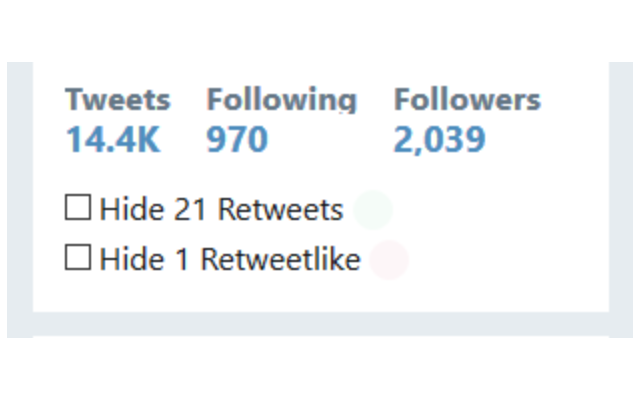
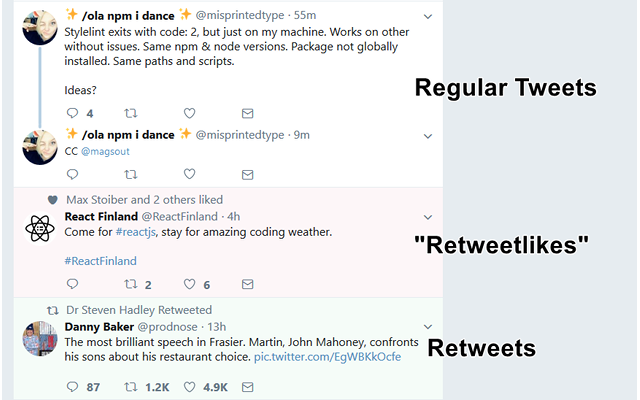

# Manage Twitter Engagement

**Manage extra "engagement" on Twitter by hiding Retweets and algorithmic timeline tweets (Retweetlikes)**

Adds controls to toggle display of Retweets and algorithmic timeline tweets (Retweetlikes) to your Twitter profile box - Retweetlikes are hidden by default.

Retweets and Retweetlikes are highlighted to make them stand out from other tweets when visible.

* [Install Chrome Extension](https://chrome.google.com/webstore/detail/manage-twitter-engagement/epgepgoafebogggijjemimfjbkidblia)
* [Install Firefox Add-on](https://addons.mozilla.org/en-US/firefox/addon/manage-twitter-engagement/)
* [Install as a user script](https://github.com/insin/manage-twitter-engagement/raw/master/manage-twitter-engagement.user.js) (requires a [user script manager](https://greasyfork.org/en#home-step-1))

## Screenshots

## Attribution

Icon adapted from "Twitter free icon" by [Icomoon](https://icomoon.io/) from [www.flaticon.com](https://www.flaticon.com/), [CC 3.0 BY](https://creativecommons.org/licenses/by/3.0/)
